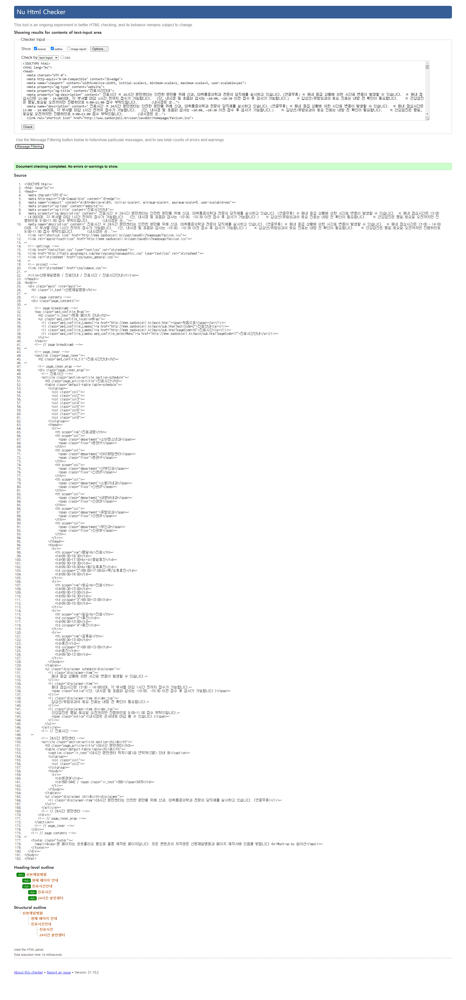
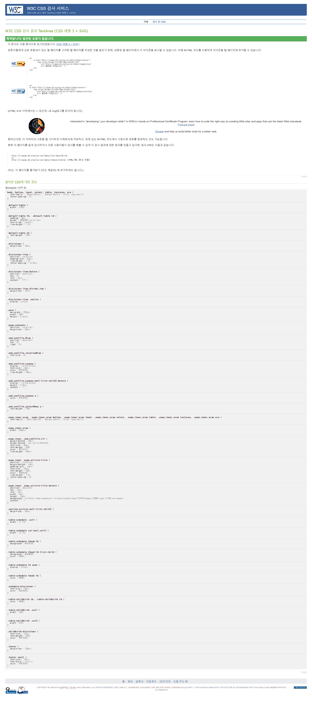

# 미션2. 접근성 높은 테이블 제작

 

---

**[ 목차 ]**

1. [접근성이 좋지 않은 테이블이 있는 웹페이지 선정](접근성이-좋지-않은-테이블이-있는-웹페이지-선정)

2. [기존 서비스의 문제점 분석](기존-서비스의-문제점-분석)

3. [수정 계획](수정-계획)

4. [웹접근성 체크리스트](웹접근성-체크리스트)

5. [수정 페이지 구현](수정-페이지-구현)

6. [문법 검사 결과](문법-검사-결과) 
   6.1. [라이트하우스 접근성 및 SEO 관련 분석 리포트](라이트하우스-접근성-및-SEO-관련-분석-리포트)

7. [진행 후기](진행-후기)

---

  

## 접근성이 좋지 않은 테이블이 있는 웹페이지 선정

문제 웹페이지 선정에는 *1. 많은 사람들이 이용하는 서비스일 것.  2. 꼭 필요한 정보를 갖고 있는 테이블일 것.* 이 두 가지를 가장 큰 기준으로 두었다. [HTML5 유효성 검사](https://validator.w3.org/)에서 문제가 되는 부분이 없다고 하더라도, 테이블이 가진 정보를 고려했을 때 마크업 요소가 빈약하거나 적절하지 않다고 느껴지는 케이스를 찾았다.

첫번째 조건으로 범위를 좁혀 병원이나 대학교 사이트를 위주로 사이트를 찾았다. 여러 병원 사이트를 검토한 결과, 두번째 조건에도 부합하는 [산본제일병원](http://www.sanbonjeil.kr/main/sub.html?pageCode=17)을 문제 웹페이지로 선정하게 되었다.

 

> **! [선정 사이트]**
>
> [산본제일병원 - 진료시간](http://www.sanbonjeil.kr/main/sub.html?pageCode=17)

  

## 기존 서비스의 문제점 분석

***― 웹표준 준수 및 웹 접근성 관점에서***

---

 

### 유효성 검사로 확인된 웹표준 관련 문제점

산본제일병원 웹페이지는 [HTML5 유효성 검사](https://validator.w3.org/)에서도 몇 가지 문제가 드러났다. 내비게이션 영역의 ID 중복 선언 문제, `ul`의 자식으로 `li`외의 요소(`div`)가 선언된 문제 등. 테이블만 한정해서 보더라도 `bgcolor`, `cellspacing`, `cellpadding` 등 표준 HTML5에서 더이상 사용하지 않는 [부적합 기능](https://dev.w3.org/html5/pf-summary/obsolete.html)이 여럿 사용되었다.

 

### 웹접근성 미비

기본적으로 `<table>` 요소를 사용할 때는 해당 [테이블의 논리적 관계](https://www.w3.org/TR/WCAG20-TECHS/H51.html)를 파악할 수 있도록 `<thead>` 혹은 `<tfoot>`요소를 선택적으로 사용한다. 테이블의 상단에 각 열을 대표하는 제목 요소가 들어간다면 `<thead>`와 `<th>`요소를 통해 각 열의 제목을 지정해주어야 한다. 마찬가지로, 각 행별로 제목 요소가 들어간다면 `<tbody>`의 자손으로도 `<th>`를 사용해 제목을 지정해준다.

문제 페이지는 진료 시간에 대해 진료과와 요일별로 시간을 안내하는 테이블 요소를 제공한다. 실제로 눈에 보이는 부분에서는 색상과 글자 두께를 통해 테이블의 각 행, 열 별 제목 요소를 구분해 두었다. 그러나, HTML 마크업을 보면 `<thead>`와 `<th>`요소의 부재를 확인할 수 있다.

이는 결국 논리적 관계의 부재로 이어진다. 표에 기재된 진료과명 '내분비내과 신관2F'(이하 내분비내과)와 '일요 진료', 그리고 '휴진'은 아무런 관계가 없는 내용이 되어버렸다. 눈으로 페이지를 확인할 수 있는 사람들과 달리, 보조 장치를 이용해 페이지를 탐색하는 사람(저시력자 등 시각에 장애가 있는 사람)이 진료 시간을 파악하기에는 어려움이 있다. 극단적으로 얘기하자면 보조 장치를 이용해 이 웹페이지에서 진료 시간을 알아내기 위해 '내분비내과'가 1열 6행에 해당하고, '일요 진료'가 4열 1행인 점을 고려해 4열 6행을 세어 탐색을 해야만 정보를 얻을 수 있다는 얘기다.

  

## 수정 계획

***―  WCAG 가이드라인에 맞춰***

---

 

앞선 단락에서 기존 서비스의 문제점을 웹표준에 위배되는 부분과 웹접근성이 떨어지는 부분으로 나누어 살펴보았다. 따라서 수정 계획도 크게 두 분류로 나눠 수립한다.

 

> 단, 수정 범위는 테이블이 있는 페이지 컨텐츠의 PC버전에만 한정(구조가 변경되는 적응형 페이지 특성상)하며, 사이드의 헤더, 푸터, 사이드 바 등의 요소는 제외한다.

 

### 웹표준 관련 수정

이 부분은 사실 간단하게 해결할 수 있다. 기존에 사용된 [부적합 기능](https://dev.w3.org/html5/pf-summary/obsolete.html)(속성)을 WCAG 가이드라인에 따라 수정해주면 된다. 이번에 선정한 웹페이지에 적용된 부적합 기능은 대부분 테이블의 스타일과 관련된 부분으로, 속성 선언 대신 CSS 스타일을 지정하는 것으로 대체한다.

 

### 웹접근성 관련 수정

[WCAG 지침](https://www.w3.org/WAI/tutorials/tables/caption-summary/)에 따라 테이블 요소 내 논리적 관계를 분명히 한다. `<thead>`와 `<th>` 태그, `[scope]` 속성을 이용해 각 셀의 정보와 테이블 내 행/열의 제목 요소(`<th>`)와 논리적으로 연결될 수 있도록 한다.

또한, 필수로 적용되어야 하는 내용은 아니나 크게 변동이 없는 고정 시간표임을 고려해 동일한 내용이 연속되어 나타나는 경우 `[colspan]` 혹은 `[rowspan]`으로 묶어서 표현한다.

 

> **! [참고 사항]**
>
> 테이블 요소의 첫번째 자식으로 위치할 수 있는 `<caption>`은 선택적으로 사용할 수 있는 요소다. `<caption>`은 웹접근성을 고려해 사용하는 것이 권장되는 사항이나, 현재 페이지의 제목과, 내비게이션의 제목, 단락의 제목 등 모두 '진료 시간(안내)'로 되어있다는 점에서 생략한다. 중복되는 정보의 잦은 제공은 또 다른 불편을 가져올 수 있다.

  

## 웹접근성 체크리스트

### 웹표준

- [ ] HTML5 표준에서 사용하지 않는 부적합 기능이 사용되었는가?
- [x] HTML5 validator를 통과하는가?
- [x] CSS validator를 통과하는가?

 

### 웹접근성

- [x] 크로스 브라우징이 지원되는가?
  - [x] IE 9++
  - [x] FF/Chrome/Safari/Opera 최신
- [x] `<table>`, `<tbody>`, `<tr>`, `<td>` 등 테이블의 필수 요소가 사용되었는가?
- [x] `<caption>`, `
`, `<thead>`, `<tfoot>`, `<th>` 등 테이블의 선택 요소가 적절히 사용되었는가?
- [x] 테이블의 요소간 논리적 관계가 구조적으로 드러나도록 마크업 되었는가?
  - [x] `<th>`와 `<td>`로 제목과 내용이 구별되었는가?
  - [x] `<th>`의 `[scope]` 속성을 통해 흐름을 정의했는가?

  

## 수정 페이지 구현

아래 바로가기 링크 참고.

1. [git - html, css등 수정된 소스](https://github.com/PPUPPA/ppuppa.github.io/tree/master/project/wa-table)
2. [구현된 페이지](https://ppuppa.github.io/project/wa-table/index.html)

  

## 문법 검사 결과

1. HTML5 validator - [link](https://validator.w3.org/)
   
2. CSS validator - [link](https://jigsaw.w3.org/css-validator/)
   

 

### 라이트하우스 접근성 및 SEO 관련 분석 리포트

[라이트하우스 리포트 PDF 링크](https://github.com/PPUPPA/ppuppa.github.io/blob/master/project/wa-table/__test/03-lighthouse.pdf)

  

## 진행 후기

사이트 선정 조건(*1. 많은 사람들이 이용하는 서비스일 것.  2. 꼭 필요한 정보를 갖고 있는 테이블일 것.*)에 해당하는 사이트 중에는 접근성이 제대로 지켜지는 서비스도 많았지만, 지켜지지 않는 서비스도 쉽게 찾을 수 있었다. 조건에 맞는 사이트를 찾는 데엔 채 30분도 걸리지 않았으니 말이다. HTML과 CSS를 배울 때 가장 먼저 배우고, 또 가장 중요하다고 느꼈던 부분인데 생각 외로 지켜지지 않는 서비스가 많아 안타까웠다.

아직 나도 많이 부족하고, 내가 작성한 코드가 완벽하게 웹접근성을 지원해주지는 못한다고 느끼는데, 현재 서비스 중인 사이트에서, 또 이런 중요한 정보를 제공하는 테이블에서 웹표준이나 웹접근성이 지켜지지 않는다는 건 안타까운 일이다. 내가 프론트엔드를 배워야겠다고 다짐했던 건 웹 페이지를 제작할 때 퍼블리셔의 역할도 중요하지만 동시에 프론트엔드 개발자도 웹접근성에 관심을 가져야 한다고 느꼈기 때문이었다. 작은 사이트의 경우 문제가 되지 않지만, 병원이나 대학교 등 큰 규모의 웹페이지를 제작할 때는 퍼블리셔의 작업물이 그대로 배포되는 게 아니라 프론트엔드의 손을 부득이하게 거치게 된다. CMS 등을 통해 사이트 소유주가 페이지 내용을 수정할 수 있게 한다면 더더욱 그렇다. 문제 페이지로 선정한 페이지가 온전히 퍼블리셔만의 작업물인지, 프론트엔드 개발자만의 작업물인지, 혹은 협업으로 제작된 작업물인지는 알 수 없지만 누군가 '잘못된 방식'으로 마크업했음은 명징하다.

웹페이지를 제작하는 데 있어 가장 기본적인 자세는 모두가 동일한(가능한 비슷한) 정보를 누릴 수 있게끔 해야한다는 것이다. 시각적으로 확인할 수 있는 비장애인과 달리 보조 장치를 사용해야 하는 시각 장애인을 위해 보이지 않는 부분에서도 더 유의할 필요가 있다.

테이블의 내용 파악을 돕는 `<caption>`사용과 구조 파악에 필요한 `<thead>`, `<tfoot>`, `<th>` 을 잘 사용해 편의성과 접근성을 높여야 한다. 이 부분은 기존에도 유의하고, 또 잘 알고 있던 부분이었지만 이번에 관련 내용을 찾아보며 새롭게 알게 된 정보도 있었다.

이를 테면, `<th>`의 `[scope]` 속성 외에, `<td>`요소와 직접 연결하는 `th[id]`와 `td[headers]` 속성을 [새롭게](https://www.w3.org/TR/WCAG20-TECHS/H43.html) 알게 되었다. `<td>`의 제목요소에 해당하는 `<th>`의 `[id]` 값을 적어 더 명확하게 셀의 제목을 표기해주는 방식인데, 더 명확하다는 장점이 있지만 각 셀마다 입력해야 하고, 그렇다보니 오타나 오기입의 이슈가 있을 수 있어 `[scope]` 속성을 더 [권장](https://developer.mozilla.org/en-US/docs/Learn/HTML/Tables/Advanced#the_id_and_headers_attributes)한다는 내용이었다. 기존처럼 `th[scope]`속성을 주로 사용하긴 하겠지만 새롭게 알게 된 내용이라 흥미롭기도 했고, 유익하기도 했다.

이번 프로젝트를 통해 웹접근성의 중요성에 대해 다시 한번 생각해볼 수 있게 되어 좋았고, 앞으로도 더 주의해서, 웹표준과 웹접근성을 간과하지 않도록 노력해야 겠다.
